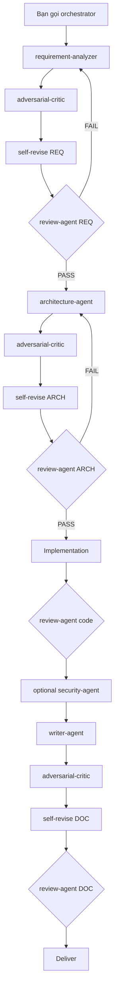

# Hướng dẫn sử dụng cursor-agents

Tài liệu này hướng dẫn cách **phối hợp 7 subagent** trong Cursor để xử lý yêu cầu IT có chất lượng, có kiểm soát rủi ro, và có thể truy vết.

> **Chưa cài đặt?** Xem [README.md](./README.md) để clone repo, chạy `setup.sh` / `setup.ps1`, và symlink `~/.cursor/agents` → `agents/`. Sau khi setup, các agent áp dụng cho **mọi project** trên máy đó.
>
> **Documentation style:** `writer-agent` mặc định theo [templates/documentation-style.md](./templates/documentation-style.md) (overview/spec, admonitions, Mermaid). **Report** (test / impact / audit) dùng [templates/report-style.md](./templates/report-style.md). Repo đích có convention mạnh hơn thì ưu tiên local.

---

## Quick path — 80% daily tasks

**Phần lớn việc hàng ngày không cần `orchestrator` hay pipeline.** Chat Cursor bình thường (main agent) là đủ.

### Quy tắc 1 dòng

| Tình huống | Làm gì |
|------------|--------|
| Typo, rename, fix 1 dòng, giải thích code | **Chat thường** — không subagent |
| Bug rõ, 1–2 file | **Chat thường** — fix trực tiếp |
| Fix xong, muốn review nhanh | **`@review-agent`** trên diff |
| Bug mơ hồ / nhiều file / cần regression ACs | **`orchestrator` + BugFixOnly** |
| Feature mới / refactor lớn | **`orchestrator` + FullFeature / RefactorOnly** |
| Review PR trước merge | **`orchestrator` + CodeReviewOnly** hoặc `@review-agent` |
| AppSec / AI / infra security | **`@security-agent`** hoặc **`orchestrator` + SecurityReviewOnly** |
| Nghiên cứu AppSec → KB topic(s) | **`@appsec-research-orchestrator`** (Mr P — Professional) |

### AppSec research skill vs security-agent

| Tool | Khi dùng |
|------|----------|
| **`@security-agent`** | Review diff/PR, threat model code/infra/AI, hardening — output Security Assessment Report |
| **`@appsec-research-orchestrator`** | Nghiên cứu topic AppSec và viết **Knowledge Base topic(s)** (#1–#12) qua pipeline Mr A→W |

Hướng dẫn đầy đủ: [`skills/appsec-research-orchestrator/references/pipeline/USER-GUIDE.md`](./skills/appsec-research-orchestrator/references/pipeline/USER-GUIDE.md)

Prompt mẫu:

```text
@appsec-research-orchestrator
Use appsec-research-orchestrator (Mr P — Professional).
Execution mode: batch.

Research Topic: HTTP cache key and Vary header correctness.
Category: web. Difficulty: intermediate. Tags: http, caching, vary.
Status: draft. Last updated: 2026-07-17.
References requirement: RFC/standards first, then OWASP.
Output mode: propose file path.
```

### Tier 0 — Mặc định (dùng hàng ngày)

```
Bạn → Main agent → xong
```

**Ví dụ:** sửa typo, thêm null check, đổi tên biến, refactor nhỏ trong 1 file.

```text
Fix null pointer trong OrderService.getTotal() khi cart rỗng.
Thêm guard clause — không cần pipeline.
```

**Không gọi:** `orchestrator`, `requirement-analyzer`, `adversarial-critic`.

### Tier 1 — Review sau khi fix (tùy chọn)

```
Bạn → Main agent fix → @review-agent review diff
```

Hoặc AppSec sâu hơn:

```
Bạn → @security-agent Review diff (App / Infra / AI)
```

```text
@review-agent Review uncommitted changes.
Artifact type: Code. Adversarial skipped — small bug fix.
```

Tương đương pipeline **CodeReviewOnly** — 1 agent, không spec, không ADV.

### Tier 2+ — Chỉ khi task đủ lớn hoặc đủ rủi ro

| Tier | Pipeline | Khi nào |
|------|----------|---------|
| 2 | **BugFixOnly** | Repro không rõ, nhiều file, production impact |
| 3 | **RefactorOnly** | Migration, tách service, cần kế hoạch rollback |
| 4 | **FullFeature** | Feature mới end-to-end (spec → design → code → docs) |

Chi tiết đầy đủ: mục **Pipeline** bên dưới.

### Mental model

```
Task nhỏ?     → Chat thường (Tier 0)
Cần chắc hơn? → + review-agent (Tier 1)
Đủ phức tạp?  → orchestrator chọn pipeline (Tier 2+)
```

> **Ghi nhớ:** Bộ agents có 9 pipeline và vòng ADV/review — đó là **công cụ cho task lớn**, không phải checklist bắt buộc mỗi lần sửa code.

---

## Tổng quan

```
Bạn (entry point)
    │
    ▼
orchestrator ──► delegate ──► requirement-analyzer | architecture-agent | writer-agent | security-agent
    │                              │
    │                              ▼
    │                    adversarial-critic (challenge)  [không bắt buộc với security-agent]
    │                              │
    │                              ▼
    │                    producer self-revise (Adversarial Self-Revision)
    │                              │
    │                              ▼
    │                    review-agent (PASS / PASS_WITH_NOTES / FAIL)
    │
    └──► deliver artifacts + Pipeline Status
```

**Nguyên tắc vàng:** `orchestrator` là điểm vào cho pipeline nhiều bước. Các agent chuyên môn làm việc sâu; `orchestrator` điều phối, không thay thế họ.

---

## Vai trò từng agent

| Agent | Vai trò | Không làm |
|-------|---------|-----------|
| `orchestrator` | Điều phối pipeline, entry point | Chuyên sâu từng lĩnh vực; không tự implement code |
| `requirement-analyzer` | Brief mơ hồ → Requirements Spec + Acceptance Criteria | Chọn tech stack; viết code |
| `architecture-agent` | Thiết kế kỹ thuật từ spec đã duyệt | Thay đổi scope; viết full code |
| `adversarial-critic` | Devil's advocate, câu hỏi Socratic | Sửa artifact; chấm PASS/FAIL |
| `review-agent` | Review chính thức: PASS / PASS_WITH_NOTES / FAIL | Thiết kế lại; hỏi Socratic mở; AppSec sâu |
| `writer-agent` | Overview, spec, ADR, guide, runbook, PR summary | Thay đổi quyết định kỹ thuật |
| `security-agent` | AppSec Node.js + Infra + AI: review, threat model, hướng dẫn fix | Thay review-agent cho correctness/style; hỏi Socratic mở |

### Input / Output (hợp đồng giữa các agent)

| Agent | Input | Output |
|-------|-------|--------|
| `requirement-analyzer` | Brief mơ hồ, ticket, ý tưởng feature | Requirements Spec |
| `architecture-agent` | Requirements Spec đã duyệt | Architecture Decision |
| `adversarial-critic` | Artifact từ producer | Adversarial Challenge Report |
| `review-agent` | Artifact sau self-revision | Review Report |
| `writer-agent` | Spec, design, hoặc ghi chú implementation | Tài liệu (overview, spec, ADR, guide, runbook, PR body) |
| `security-agent` | Diff, design, config infra/AI, hoặc brief security | Security Assessment Report |

---

## Pipeline (định nghĩa trong orchestrator)

Chọn pipeline phù hợp **trước khi** bắt đầu. Nếu không chắc, gọi `orchestrator` và mô tả mục tiêu — nó sẽ phân loại hoặc hỏi lại.

### 1. FullFeature

Luồng đầy đủ cho feature mới hoặc refactor lớn:

```
requirement-analyzer → adversarial-critic → self-revise → review-agent
→ architecture-agent → adversarial-critic → self-revise → review-agent
→ [implementation bởi main agent hoặc bạn]
→ review-agent (code, nếu có)
→ [optional: security-agent — khi đụng auth, secrets, AI, hoặc infra]
→ writer-agent → adversarial-critic → self-revise → review-agent
→ deliver
```

### 2. RequirementsOnly

Chỉ cần spec chuẩn hóa, không cần thiết kế hay code:

```
requirement-analyzer → adversarial-critic → self-revise → review-agent → deliver
```

### 3. ArchitectureOnly

Đã có Requirements Spec; cần thiết kế kỹ thuật:

```
architecture-agent → adversarial-critic → self-revise → review-agent → deliver
```

> **Bắt buộc:** Phải cung cấp Requirements Spec làm input.

### 4. CodeReviewOnly

Review diff/PR trước merge — bỏ qua REQ/ARCH/ADV trừ khi bạn yêu cầu:

```
review-agent trên diff/artifact → deliver
```

### 5. SecurityReviewOnly

AppSec / Infra / AI security review — bỏ qua REQ/ARCH/ADV trừ khi bạn yêu cầu:

```
security-agent trên diff/design/infra/AI config → deliver
```

> **Output:** Security Assessment Report (verdict + findings + fix guidance).  
> **Khi nào:** Review bảo mật, threat model, hardening auth/AI/infra.

### 6. DocsOnly

Tài liệu là deliverable chính:

```
writer-agent → adversarial-critic → self-revise → review-agent → deliver
```

### 7. BugFixOnly

Bug **không trivial** — repro chưa rõ, nhiều file, hoặc cần regression ACs. Bug một dòng → không pipeline.

```
requirement-analyzer (mini Bug Fix Spec)
→ adversarial-critic → self-revise → review-agent
→ [implementation bởi main agent hoặc bạn]
→ review-agent (code)
→ [optional: security-agent — khi fix đụng auth, secrets, AI, hoặc infra]
→ deliver
```

### 8. RefactorOnly

Refactor / migration có thiết kế trước code — nhẹ hơn FullFeature (không bắt buộc docs cuối).

```
[optional: requirement-analyzer — scope refactor nếu brief mơ hồ]
→ architecture-agent (refactor/migration design)
→ adversarial-critic → self-revise → review-agent
→ [implementation]
→ review-agent (code)
→ [optional: security-agent — khi refactor đụng auth, secrets, AI, hoặc infra]
→ [optional: writer-agent — migration notes]
→ deliver
```

### 9. IncidentToRunbook

Sau sự cố: post-mortem rồi runbook vận hành.

```
writer-agent (post-mortem)
→ adversarial-critic → self-revise → review-agent
→ writer-agent (runbook)
→ adversarial-critic → self-revise → review-agent
→ deliver
```

### Sơ đồ pipeline FullFeature



---

## Vòng lặp cốt lõi (mỗi phase producer)

Mỗi lần `requirement-analyzer`, `architecture-agent`, hoặc `writer-agent` tạo artifact, `orchestrator` chạy **cùng một vòng lặp**:

| Bước | Hành động |
|------|-----------|
| 1 | Delegate cho producer agent (kèm full context) |
| 2 | Delegate cho `adversarial-critic` với **toàn bộ artifact** |
| 3 | Producer hoàn thành bảng `## Adversarial Self-Revision` |
| 4 | **Gate:** Mọi câu hỏi BLOCKING đã trả lời, hoặc ACCEPTED_RISK được **bạn** duyệt |
| 5 | Delegate cho `review-agent` |
| 6 | PASS hoặc PASS_WITH_NOTES → tiếp tục; FAIL → retry (tối đa 2 lần/agent/phase) |

```
Producer → adversarial-critic → Self-Revision → [Gate BLOCKING] → review-agent → [Gate verdict]
```

> **Quan trọng:** Không gọi `review-agent` trước khi producer hoàn thành Adversarial Self-Revision (trừ short-circuit đã ghi nhận).

---

## Quality gates

| Tình huống | Hành vi |
|------------|---------|
| Còn câu hỏi **BLOCKING** chưa giải quyết | Pipeline **tạm dừng** — `orchestrator` hỏi bạn |
| **ACCEPTED_RISK** trong self-revision | Cần **bạn duyệt rõ ràng** trước khi tiếp tục |
| `review-agent` trả **FAIL** | Retry producer với Re-review Criteria (tối đa **2 lần**/agent/phase) |
| Hết 2 lần retry | Escalate lên bạn: tóm tắt, lựa chọn, khuyến nghị |

### Gate sau từng phase (orchestrator kiểm tra)

| Sau phase | Điều kiện pass |
|-----------|----------------|
| requirement-analyzer + self-revision | AC testable; không BLOCKING mở; Open Questions có giới hạn |
| architecture-agent + self-revision | Traceability đầy đủ; trade-offs ghi rõ; không BLOCKING mở |
| review-agent | Verdict PASS hoặc PASS_WITH_NOTES |
| security-agent | Verdict PASS hoặc PASS_WITH_NOTES; không còn Critical/High chưa xử lý |
| writer-agent + self-revision | Doc đủ cho audience; không BLOCKING mở |

---

## Short-circuit (bỏ qua pipeline đầy đủ)

Dùng khi task **đủ nhỏ** hoặc bạn **chủ động** rút gọn:

| Điều kiện | Ví dụ |
|-----------|-------|
| Task trivial | Sửa typo, rename, one-liner, giải thích một function |
| Bạn nói rõ `"skip adversarial"` | Ghi vào Pipeline Status |
| Chỉ cần review code | `CodeReviewOnly` |
| Chỉ cần AppSec / security | `SecurityReviewOnly` |
| Chỉ cần tài liệu | `DocsOnly` |

Khi short-circuit, `orchestrator` phải nêu **phase nào bị bỏ** và **lý do**.

---

## Pipeline Status (orchestrator emit mỗi response)

Mỗi lần `orchestrator` trả lời trong pipeline, bạn sẽ thấy block sau — dùng để theo dõi tiến độ:

```markdown
## Pipeline Status
- Pipeline: FullFeature | RequirementsOnly | ArchitectureOnly | RefactorOnly | BugFixOnly | IncidentToRunbook | CodeReviewOnly | SecurityReviewOnly | DocsOnly
- Current phase:
- Last agent:
- Producer retry: N/2 (agent/phase hiện tại)
- Adversarial round: N (số vòng challenge trong phase hiện tại)
- Open BLOCKING questions: <count or list>
- Review verdict: PASS | PASS_WITH_NOTES | FAIL | N/A
- Security verdict: PASS | PASS_WITH_NOTES | FAIL | N/A | skipped
- Next action:
- Blockers:
- Skipped phases (if any):
```

| Trường | Ý nghĩa |
|--------|---------|
| **Pipeline** | Pipeline đang chạy |
| **Current phase** | Bước hiện tại (vd. Requirements challenge, Architecture review) |
| **Last agent** | Agent vừa chạy xong |
| **Producer retry** | Số lần retry producer sau FAIL (tối đa 2/agent/phase) |
| **Adversarial round** | Số vòng adversarial-critic trong phase hiện tại |
| **Open BLOCKING questions** | Câu hỏi chặn pipeline — phải = 0 hoặc ACCEPTED_RISK đã duyệt |
| **Review verdict** | Kết quả review gần nhất |
| **Security verdict** | Kết quả `security-agent` (hoặc skipped nếu không chạy) |
| **Next action** | Bước tiếp theo orchestrator sẽ làm |
| **Blockers** | Điều đang chặn (cần input từ bạn) |
| **Skipped phases** | Phase bị bỏ (short-circuit) |

---

## Khi nào dùng pipeline nào?

| Tình huống | Pipeline | Ghi chú |
|------------|----------|---------|
| Ý tưởng feature mơ hồ → spec → design → code → docs | **FullFeature** | Entry point mặc định cho feature mới |
| Ticket cần AC chuẩn, chưa cần arch | **RequirementsOnly** | Output: Requirements Spec |
| Đã có spec, cần thiết kế kỹ thuật | **ArchitectureOnly** | Đính kèm Requirements Spec |
| Refactor / migration có kế hoạch | **RefactorOnly** | Nhẹ hơn FullFeature; optional migration doc |
| Bug không trivial, cần regression ACs | **BugFixOnly** | Mini spec → fix → code review |
| Sự cố production → post-mortem + runbook | **IncidentToRunbook** | Hai phase doc: post-mortem rồi runbook |
| Review PR trước merge | **CodeReviewOnly** | Gọi trực tiếp `review-agent` hoặc qua orchestrator |
| AppSec / AI / infra hardening | **SecurityReviewOnly** | Gọi `@security-agent` hoặc qua orchestrator |
| Runbook / ADR / guide đơn lẻ | **DocsOnly** | writer → ADV → review |
| Refactor lớn (full spec + arch) | **FullFeature** | Có thể **dừng sau Architecture PASS** rồi implement |
| Bug nhỏ, fix một dòng | **Không pipeline** | Main agent hoặc agent đơn lẻ |

---

## Ví dụ use case + prompt mẫu

Các prompt dưới đây trộn tiếng Việt (mô tả nghiệp vụ) với keyword tiếng Anh (tên agent/pipeline). Copy và chỉnh cho project của bạn.

### 1. Feature mới từ ý tưởng mơ hồ → FullFeature

```text
Dùng orchestrator, pipeline FullFeature.

Brief: Cần thêm tính năng export báo cáo PDF cho module đơn hàng.
User là kế toán, cần xuất theo khoảng ngày và filter theo trạng thái thanh toán.
Chưa rõ format PDF hay giới hạn số dòng.

Bắt đầu từ requirement-analyzer. Emit Pipeline Status sau mỗi bước.
```

### 2. Ticket cần AC chuẩn → RequirementsOnly

```text
Dùng orchestrator, pipeline RequirementsOnly.

Input ticket JIRA-4521:
"API login chậm khi traffic cao, cần cải thiện."

Chuẩn hóa thành Requirements Spec có AC testable.
Không cần architecture hay code trong pipeline này.
```

### 3. Đã có spec, cần architecture → ArchitectureOnly

```text
Dùng orchestrator, pipeline ArchitectureOnly.

Requirements Spec (đã duyệt):
<paste Requirements Spec>

Thiết kế Architecture Decision: components, data flow, trade-offs, phases triển khai.
```

### 4. Review PR trước merge → CodeReviewOnly

```text
Dùng orchestrator, pipeline CodeReviewOnly.

Review diff branch feature/export-pdf so với main.
Tập trung: security, error handling, test coverage, breaking changes.
Trả Review Report với verdict PASS / PASS_WITH_NOTES / FAIL.
```

Hoặc gọi trực tiếp:

```text
@review-agent Review git diff uncommitted changes.
Artifact type: Code. Adversarial đã skip (trivial PR).
```

### 4b. AppSec / AI / infra → SecurityReviewOnly

```text
Dùng orchestrator, pipeline SecurityReviewOnly.

Review uncommitted changes / PR auth JWT + RAG tool-calling.
Domains: App, AI. Mode: Review.
Trả Security Assessment Report + hướng dẫn fix cho Critical/High.
```

Hoặc gọi trực tiếp:

```text
@security-agent Mode: Review. Domains: App, Infra, AI.
Target: uncommitted changes (auth middleware + Dockerfile + MCP tools).
Produce Security Assessment Report.
```

### 5. Runbook / doc đơn lẻ → DocsOnly

```text
Dùng orchestrator, pipeline DocsOnly.

Nguồn: ghi chú setup môi trường staging mới.
Deliverable: Setup guide — prerequisites, steps, verification, troubleshooting.
Style: follow cursor-agents `templates/documentation-style.md` unless the target repo has stronger local doc conventions.
```

### 6. Sự cố production → IncidentToRunbook

```text
Dùng orchestrator, pipeline IncidentToRunbook.

Nguồn: sự cố DB connection pool exhausted ngày 2026-07-01.
Notes: alert 03:12, pool max 20, traffic spike từ batch job.
Deliverable: post-mortem rồi runbook vận hành (rollback, escalation).
```

### 7. Bug không trivial → BugFixOnly

```text
Dùng orchestrator, pipeline BugFixOnly.

Ticket: Order total sai khi cart có discount stack + coupon.
Repro: thêm 2 discount % rồi apply coupon fixed amount.
Cần mini spec + regression ACs trước khi fix.
```

### 8. Refactor có migration plan → RefactorOnly

```text
Dùng orchestrator, pipeline RefactorOnly.

Brief: Tách OrderService payment logic sang PaymentService.
Constraints: zero downtime, feature flag rollout.
Cần architecture (phases, rollback) trước implement.
Sau code PASS, optional migration notes doc.
```

### 9. Refactor lớn → FullFeature (dừng sau Architecture)

```text
Dùng orchestrator, pipeline FullFeature.

Brief: Tách monolith payment service thành microservice riêng.
Scope lớn — chạy đủ REQ và ARCH phases.

Sau khi Architecture Decision PASS, DỪNG pipeline.
Tôi sẽ implement thủ công rồi gọi lại CodeReviewOnly sau.
```

### 10. Bug nhỏ → không pipeline

```text
Fix null pointer trong OrderService.getTotal() khi cart rỗng.
One-line guard clause — không cần orchestrator hay adversarial.
```

---

## Anti-patterns (tránh)

| Anti-pattern | Vì sao sai | Cách đúng |
|--------------|------------|-----------|
| Gọi `architecture-agent` khi requirements chưa rõ | Thiết kế không traceable; scope trôi | `RequirementsOnly` hoặc FullFeature phase REQ trước |
| Skip adversarial trên feature lớn mà không hỏi | Bỏ lỡ giả định ẩn, rủi ro | Chỉ skip khi trivial hoặc bạn nói rõ `"skip adversarial"` |
| Gọi `review-agent` trước self-revision | Review thiếu câu trả lời BLOCKING | Luôn: ADV → Self-Revision → review |
| Kỳ vọng `orchestrator` viết code | Orchestrator chỉ điều phối | Implementation: main agent / bạn; code review: `review-agent` |
| Không paste full artifact khi delegate | Subagent không nhớ context cũ | Luôn đính kèm artifact đầy đủ + pipeline name + phase |
| Retry quá 2 lần im lặng | Lãng phí token, không giải quyết gốc | Sau 2 FAIL → escalate, quyết định với user |

---

## Cheat sheet — prompt copy nhanh

### Bắt đầu pipeline

```text
Dùng orchestrator, pipeline [FullFeature|RequirementsOnly|ArchitectureOnly|RefactorOnly|BugFixOnly|IncidentToRunbook|CodeReviewOnly|SecurityReviewOnly|DocsOnly].
Brief: <mô tả ngắn>
Emit Pipeline Status mỗi response.
```

### Chỉ cần requirements

```text
orchestrator + RequirementsOnly + brief: <ticket/ý tưởng>
```

### Chỉ cần architecture (đã có spec)

```text
orchestrator + ArchitectureOnly
Requirements Spec: <paste>
```

### Review PR nhanh

```text
orchestrator + CodeReviewOnly
Review diff: <branch hoặc uncommitted>
```

### Security / AppSec nhanh

```text
orchestrator + SecurityReviewOnly
# hoặc: @security-agent Mode: Review. Domains: App|Infra|AI. Target: <diff>
```

### Bug fix có cấu trúc

```text
orchestrator + BugFixOnly + ticket/repro: <mô tả>
```

### Refactor / migration

```text
orchestrator + RefactorOnly + brief: <mô tả refactor>
```

### Post-incident

```text
orchestrator + IncidentToRunbook + notes: <timeline, impact>
```

### Viết tài liệu

```text
orchestrator + DocsOnly
Loại doc: [ADR|setup guide|runbook|PR summary]
Nguồn: <spec/design/notes>
```

### Dừng sau architecture

```text
FullFeature — dừng sau Architecture PASS, không implement trong pipeline này.
```

### Skip adversarial (chỉ khi chủ động)

```text
skip adversarial — task trivial: <mô tả>
Ghi Skipped phases trong Pipeline Status.
```

### Escalate khi bị block

```text
Pipeline đang block vì BLOCKING question #2.
Tôi chọn: [trả lời / ACCEPTED_RISK với lý do: ...]
Tiếp tục pipeline.
```

---

## Gọi agent đơn lẻ (không qua orchestrator)

Hợp lệ khi scope nhỏ và rõ:

| Agent | Khi gọi trực tiếp |
|-------|-------------------|
| `requirement-analyzer` | Brief đơn giản, không cần ADV/review |
| `architecture-agent` | Đã có spec, một câu hỏi thiết kế cụ thể |
| `adversarial-critic` | Muốn challenge artifact có sẵn (không formal review) |
| `review-agent` | Review diff/PR (`CodeReviewOnly`) |
| `writer-agent` | Draft doc nhanh, không cần full DocsOnly pipeline |
| `security-agent` | AppSec / Infra / AI review hoặc threat model (`SecurityReviewOnly`) |

> Với feature/refactor **không trivial**, vẫn nên qua `orchestrator` để gates và retry được enforce.

---

## Checklist trước khi merge / ship

- [ ] Đúng pipeline cho scope task
- [ ] Mọi artifact có `## Adversarial Self-Revision` (nếu đã chạy ADV)
- [ ] Không còn BLOCKING mở (hoặc ACCEPTED_RISK đã duyệt)
- [ ] `review-agent` verdict: PASS hoặc PASS_WITH_NOTES
- [ ] Nếu đụng auth/secrets/AI/infra: `security-agent` đã chạy (hoặc lý do skip ghi trong Pipeline Status)
- [ ] Pipeline Status ghi rõ phase skipped (nếu có)
- [ ] Deliverables: spec / arch / code review / security / docs — liệt kê rõ cho team

---

## Tài liệu liên quan

| File | Nội dung |
|------|----------|
| [README.md](./README.md) | Cài đặt, symlink, troubleshooting |
| [templates/documentation-style.md](./templates/documentation-style.md) | Markdown style mặc định cho writer-agent (overview/spec, callouts, Mermaid) |
| [templates/report-style.md](./templates/report-style.md) | Report test / impact / audit (embedded CSS, verdict badges, item cards) |
| `agents/orchestrator.md` | Định nghĩa pipeline, gates, delegation |
| `agents/requirement-analyzer.md` | Template Requirements Spec |
| `agents/architecture-agent.md` | Template Architecture Decision |
| `agents/adversarial-critic.md` | Tier câu hỏi BLOCKING / IMPORTANT / EXPLORATORY |
| `agents/review-agent.md` | Checklist và verdict rules |
| `agents/writer-agent.md` | Template overview, spec, ADR, guide, runbook, PR body |
| `agents/security-agent.md` | AppSec App/Infra/AI — Security Assessment Report |
| `skills/appsec-research-orchestrator/SKILL.md` | AppSec KB research pipeline (Mr P — Professional) |
| `skills/appsec-research-orchestrator/references/pipeline/USER-GUIDE.md` | Hướng dẫn invoke orchestrator (tiếng Việt) |
| `skills/kb-write-topic/SKILL.md` | Viết một KB topic nhanh, không qua multi-role pipeline |

---

## Adversarial Self-Revision

<!-- Meta-doc: không qua adversarial-critic trong pipeline tạo file này. Placeholder cho tích hợp pipeline. -->

| Question ID | Response type | Response | Doc change |
|-------------|---------------|----------|------------|
| N/A | N/A | Tài liệu hướng dẫn meta — không có vòng ADV formal | Không áp dụng |
