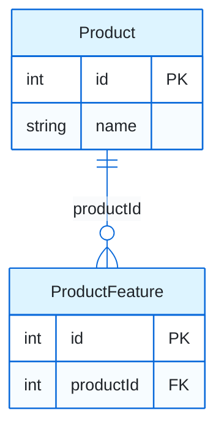
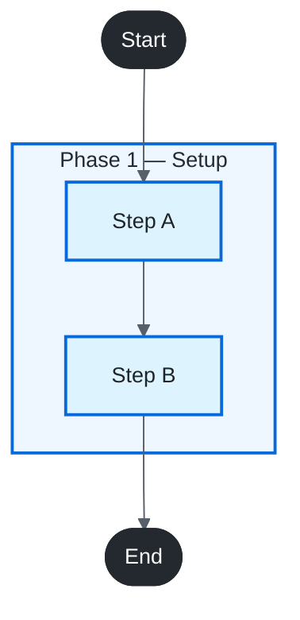

# Document Style Guide

Portable markdown + embedded CSS for **all structured documentation** produced by `writer-agent` and report generators. Uses HTML inside markdown for rich preview in Cursor / VS Code / GitHub.

**Golden reference:** `license_app/docs/architecture/entity-relationships.md`

**Style resolution (in order):**

1. Target repo local convention (`docs/DOCUMENT-STYLE.md`, `docs/REPORT-STYLE.md`, or existing styled report in repo)
2. This guide (`cursor-agents/templates/document-style.md`)

> `writer-agent` uses **only** this template. Do not use GitHub admonitions (`> [!IMPORTANT]`) — use `.callout`, `.change-box`, and `.conclusion-panel` instead.

---

## 1. When to use

| Doc type | Examples | Audience |
|----------|----------|----------|
| **Architecture / ER** | Entity relationships, system overview, domain diagrams | BA, PO, architects |
| **Module overview** | Capability summary, user flow, architecture | Architects, PM, tech leads |
| **Implementation spec** | Schema, REST DTOs, contracts | Backend / FE developers |
| **Test report** | API/integration test runs, manual test evidence | QA, tech leads |
| **Impact report** | Breaking-change, migration, dependency audit | Architects, backend devs |
| **Audit report** | Codebase scan + runtime checks | Security, compliance, release |
| **ADR** | Architecture decision record | Engineers reviewing a choice |
| **Setup guide / runbook** | Install, configure, operate, recover | Onboarding, on-call |
| **PR summary / changelog** | Pull request body, release notes | Reviewers, consumers |

Use this style when the deliverable has:

- Executive summary with counts or key metrics
- TOC with anchor links
- Sections with `section-header` and optional `report-item` cards
- Mermaid ER diagrams or flowcharts in `diagram-panel` wrappers
- Dense tables for matrices, join keys, business rules

---

## 2. Report skeleton

```markdown
# <Title>

<style>
/* Paste full CSS from §3 */
</style>

<p class="report-meta">
  <strong>Version:</strong> 0.1 (Draft) &nbsp;|&nbsp;
  <strong>Status:</strong> … &nbsp;|&nbsp;
  <strong>Audience:</strong> … &nbsp;|&nbsp;
  <strong>Last updated:</strong> YYYY-MM-DD
</p>

## Table of Contents
- [Executive summary](#executive-summary)
- [1. …](#1-…)
- [2. …](#2-…)

## Executive summary
<!-- stats-wrap + conclusion-panel -->

<div class="change-box">
<h3>How to read this document</h3>
…
</div>

<div class="section-header"><h2>Section 1 — …</h2></div>

<div class="report-item">
<h2 class="report-item-title"><span class="item-badge">E1</span> Entity / item title</h2>
<!-- detail content -->
</div>
```

> **Class aliases:** Reports may use `.test-case` / `.tc-badge` (legacy) or `.report-item` / `.item-badge` (generic). Prefer `.report-item` for new docs.

---

## 3. Embedded CSS (copy verbatim)

```css
/* ── Report layout ── */
.report-meta { color: #57606a; font-size: 0.95rem; line-height: 1.6; margin: 0 0 1.25rem; }
.report-meta strong { color: #24292f; }
.deadline { color: #cf222e; font-weight: 700; }

/* ── Callouts ── */
.callout { border-left: 4px solid #0969da; background: #f6f8fa; padding: 12px 16px; margin: 1rem 0; border-radius: 0 6px 6px 0; font-size: 0.97rem; line-height: 1.55; }
.callout-success { border-left-color: #1a7f37; background: #f0fff4; }
.callout-warning { border-left-color: #bf8700; background: #fffbeb; }
.callout-danger  { border-left-color: #cf222e; background: #fff5f5; }
.callout-title   { font-weight: 700; margin-bottom: 6px; color: #24292f; }

/* ── Overall conclusion panel ── */
.conclusion-panel {
  border: 1px solid #c6e6c6;
  border-radius: 8px;
  overflow: hidden;
  margin: 1.5rem 0 2rem;
  box-shadow: 0 2px 10px rgba(26, 127, 55, 0.08);
}
.conclusion-header {
  display: flex;
  align-items: center;
  gap: 10px;
  background: linear-gradient(180deg, #1a472a 0%, #216e3a 100%);
  color: #fff;
  padding: 12px 20px;
  font-weight: 700;
  font-size: 0.92rem;
  letter-spacing: 0.04em;
  text-transform: uppercase;
}
.conclusion-header::before {
  content: "✓";
  display: inline-flex;
  align-items: center;
  justify-content: center;
  width: 22px;
  height: 22px;
  background: rgba(255, 255, 255, 0.18);
  border-radius: 50%;
  font-size: 0.78rem;
  flex-shrink: 0;
}
.conclusion-body {
  background: linear-gradient(180deg, #fafffe 0%, #f6fbf7 100%);
  padding: 18px 22px;
}
.conclusion-lead {
  font-size: 1.02rem;
  line-height: 1.55;
  color: #1f2328;
  margin: 0;
}

/* ── Stats tables ── */
.stats-wrap { display: flex; flex-wrap: wrap; gap: 1.5rem; margin: 1rem 0; }
.stats-table { width: auto; font-size: 0.95rem; border-collapse: collapse; }
.stats-table th { background: #f6f8fa; font-weight: 600; text-align: left; padding: 6px 14px; border: 1px solid #d0d7de; }
.stats-table td { padding: 6px 14px; border: 1px solid #d0d7de; text-align: center; }

/* ── Global markdown tables ── */
table { border-collapse: collapse; width: 100%; font-size: 0.92rem; margin: 0.75rem 0; }
th { background: #f6f8fa; font-weight: 600; text-align: left; }
th, td { border: 1px solid #d0d7de; padding: 6px 10px; vertical-align: top; }
code { font-size: 0.88em; background: #eff1f3; padding: 1px 5px; border-radius: 4px; }

/* ── Summary / impact table ── */
.impact-table { width: 100%; table-layout: fixed; font-size: 0.78rem; line-height: 1.45; border-collapse: collapse; margin: 0.5rem 0 1.5rem; }
.impact-table th { background: #24292f; color: #fff; font-weight: 600; font-size: 0.74rem; text-transform: uppercase; letter-spacing: 0.02em; padding: 8px 6px; border: 1px solid #57606a; vertical-align: bottom; }
.impact-table td { border: 1px solid #d0d7de; padding: 7px 6px; vertical-align: top; word-wrap: break-word; overflow-wrap: anywhere; }
.impact-table tr:nth-child(even) td { background: #f6f8fa; }
.impact-table tr:hover td { background: #eef6ff; }
.impact-table .col-num     { text-align: center; font-weight: 600; color: #57606a; }
.impact-table .col-endpoint code { font-size: 0.76rem; word-break: break-all; }
.impact-table .col-cryptlex { font-size: 0.74rem; color: #424a53; }
.impact-table .col-change  { text-align: center; white-space: nowrap; }
.impact-table .col-tc      { font-size: 0.74rem; }
.impact-table .col-verdict { text-align: center; }
.impact-table .col-code    { text-align: center; }
.impact-table .col-action  { font-size: 0.74rem; }

/* ── Badges & highlights ── */
.verdict { display: inline-block; font-weight: 700; font-size: 0.80rem; padding: 2px 7px; border-radius: 10px; letter-spacing: 0.03em; }
.verdict.pass     { color: #1a7f37; background: #dafbe1; }
.verdict.fail     { color: #cf222e; background: #ffebe9; }
.verdict.skipped  { color: #9a6700; background: #fff8c5; }

.code-update { font-weight: 700; font-size: 0.86rem; }
.code-update.no       { color: #1a7f37; }
.code-update.unlikely { color: #9a6700; }
.code-update.yes      { color: #cf222e; }

.action { font-size: 0.82rem; font-weight: 600; }
.action.none    { color: #57606a; }
.action.manual  { color: #0969da; }
.action.required { color: #9a6700; }
.action.optional { color: #57606a; }

.tag-skip   { color: #9a6700; font-weight: 700; }
.tag-review { color: #0969da; font-weight: 700; }
.tag-ok     { color: #1a7f37; font-weight: 700; }
.note-detail { display: block; margin-top: 4px; font-size: 0.80rem; color: #57606a; line-height: 1.4; }
.em-dash { color: #8c959f; }

h2 { border-bottom: 1px solid #d0d7de; padding-bottom: 0.35em; margin-top: 2em; }
h3 { margin-top: 1.25em; color: #24292f; }
.section-desc { font-size: 0.95rem; color: #57606a; margin: 0 0 10px; line-height: 1.5; }
.change-box { background: #f6f8fa; border: 1px solid #d0d7de; border-radius: 6px; padding: 12px 16px; margin: 10px 0; font-size: 0.95rem; line-height: 1.55; }
.change-box h3 { margin: 0 0 8px; font-size: 1.02rem; }
.change-box .unchanged { margin-top: 10px; padding-top: 8px; border-top: 1px dashed #d0d7de; font-size: 0.90rem; }
.impact-unknown { color: #9a6700; font-weight: 700; }
.impact-ok      { color: #1a7f37; font-weight: 700; }
.impact-break   { color: #cf222e; font-weight: 700; }

.section-header { background: linear-gradient(135deg, #24292f 0%, #424a53 100%); color: #fff; padding: 12px 18px; border-radius: 6px; margin: 2.5rem 0 1.25rem; }
.section-header h2 { color: #fff; border: none; margin: 0; padding: 0; font-size: 1.12rem; letter-spacing: 0.01em; }

/* ── Item cards (generic + test-case alias) ── */
.report-item, .test-case {
  border: 1px solid #b8c5d0;
  border-radius: 8px;
  margin: 2.25rem 0;
  padding: 0 20px 1.5rem;
  background: #fff;
  box-shadow: 0 2px 8px rgba(27, 31, 36, 0.07);
}
.report-item + .report-item, .test-case + .test-case { margin-top: 2.5rem; }
.report-item-title, .test-case-title {
  margin: 0 -20px 1.25rem !important;
  padding: 14px 20px !important;
  background: linear-gradient(180deg, #eef3f7 0%, #e2eaf0 100%);
  color: #1f2328 !important;
  border: none !important;
  border-bottom: 1px solid #c5d0da !important;
  border-left: 5px solid #3d6b8a !important;
  border-radius: 8px 8px 0 0;
  font-size: 1.06rem !important;
  line-height: 1.4;
  letter-spacing: 0.01em;
}
.item-badge, .tc-badge {
  display: inline-block;
  background: #3d6b8a;
  border: 1px solid #2f5570;
  color: #fff;
  padding: 3px 11px;
  border-radius: 4px;
  font-weight: 700;
  margin-right: 12px;
  font-size: 0.85em;
  letter-spacing: 0.05em;
  vertical-align: middle;
  box-shadow: 0 1px 2px rgba(47, 85, 112, 0.25);
}
.report-item h3, .test-case h3 {
  color: #2f3d4a;
  border-bottom: 1px solid #d8e0e8;
  padding-bottom: 0.35em;
  margin-top: 1.5rem;
  font-size: 0.97rem;
}
.report-item h4, .test-case h4 { color: #4a5866; margin-top: 1rem; font-size: 0.92rem; }

.appendix-table { font-size: 0.88rem; table-layout: fixed; width: 100%; }
.appendix-table .col-tc { width: 6%; text-align: center; font-weight: 600; }
.appendix-table .col-verdict { width: 8%; text-align: center; }

/* ── Diagram panels ── */
.diagram-panel {
  border: 1px solid #c5d0da;
  border-radius: 8px;
  background: #fafbfc;
  padding: 16px 12px 8px;
  margin: 0 0 1.25rem;
  overflow-x: auto;
}
.diagram-caption {
  font-size: 0.88rem;
  color: #57606a;
  text-align: center;
  margin: 0.75rem 0 0.5rem;
  font-style: italic;
}
.legend-table { width: 100%; font-size: 0.85rem; margin: 0; }
.legend-table td { padding: 4px 8px; border: none; vertical-align: top; }
.legend-table td:first-child { font-weight: 600; white-space: nowrap; width: 1%; color: #24292f; }

/* ── Diagram domain color accents ── */
.diagram-panel--catalog     { background: linear-gradient(180deg, #f8fbff 0%, #fafbfc 100%); border-color: #b6d4fe; border-left: 4px solid #0969da; }
.diagram-panel--blueprint   { background: linear-gradient(180deg, #faf8ff 0%, #fafbfc 100%); border-color: #d4c4f0; border-left: 4px solid #6e40c9; }
.diagram-panel--fulfillment { background: linear-gradient(180deg, #f6fffa 0%, #fafbfc 100%); border-color: #b8e6c8; border-left: 4px solid #1a7f37; }
.diagram-panel--customer    { background: linear-gradient(180deg, #fffcf5 0%, #fafbfc 100%); border-color: #f0d89a; border-left: 4px solid #bf8700; }
.diagram-panel--context     { background: linear-gradient(180deg, #f8fbff 0%, #fffcf5 100%); border-color: #c5d0da; border-left: 4px solid #3d6b8a; }
.diagram-panel--flow        { background: linear-gradient(180deg, #fafbfc 0%, #f6f8fa 100%); border-color: #c5d0da; border-left: 4px solid #424a53; }

.color-key {
  display: flex;
  flex-wrap: wrap;
  gap: 8px 14px;
  margin: 10px 0 0;
  padding: 0;
  list-style: none;
}
.color-key li {
  display: inline-flex;
  align-items: center;
  gap: 6px;
  font-size: 0.82rem;
  color: #424a53;
}
.color-swatch {
  display: inline-block;
  width: 14px;
  height: 14px;
  border-radius: 3px;
  border: 1px solid rgba(27, 31, 36, 0.15);
  flex-shrink: 0;
}
.color-swatch--catalog     { background: #ddf4ff; border-color: #0969da; }
.color-swatch--blueprint   { background: #e8dfff; border-color: #6e40c9; }
.color-swatch--fulfillment { background: #dafbe1; border-color: #1a7f37; }
.color-swatch--customer    { background: #fff8c5; border-color: #bf8700; }
.color-swatch--cross       { background: repeating-linear-gradient(135deg, #f6f8fa, #f6f8fa 3px, #d0d7de 3px, #d0d7de 4px); border-color: #8c959f; }
```

---

## 4. HTML patterns

### Metadata

```html
<p class="report-meta">
  <strong>Version:</strong> 1.0 &nbsp;|&nbsp;
  <strong>Status:</strong> Approved &nbsp;|&nbsp;
  <strong>Audience:</strong> BA, PO &nbsp;|&nbsp;
  <strong>Last updated:</strong> 2026-07-21
</p>
```

### Context / scope box

```html
<div class="change-box">
<h3>Scope / change</h3>
Before <span class="deadline">2026-09-01</span>, …
</div>
```

### Callout (replaces GitHub admonitions)

```html
<div class="callout callout-warning">
<div class="callout-title">Document authority</div>
This overview is the architecture summary. <a href="./spec.md">spec.md</a> is canonical for schema and REST DTOs.
</div>
```

### Conclusion panel

```html
<div class="conclusion-panel">
<div class="conclusion-header">Architecture at a glance</div>
<div class="conclusion-body">
<p class="conclusion-lead"><strong>Main finding</strong> in one sentence. See <a href="#12-section">§1.2</a> for detail.</p>
</div>
</div>
```

### Section + item card

```html
<div class="section-header"><h2>Section 2 — Domain diagrams</h2></div>

<div class="report-item">
<h2 class="report-item-title"><span class="item-badge">E1</span> Product</h2>
<!-- tables, field detail -->
</div>
```

### Diagram wrapper + caption

```html
<p class="diagram-caption"><strong>Figure 2.1</strong> — Product catalog: PK/FK fields on entities</p>

<div class="diagram-panel diagram-panel--catalog">

```mermaid
…
```

</div>
```

### Diagram legend (in change-box)

```html
<div class="change-box">
<h3>Diagram legend</h3>
<table class="legend-table">
<tr><td>PK</td><td>Primary key on the entity</td></tr>
<tr><td>FK</td><td>Foreign key referencing another entity</td></tr>
<tr><td>||--o{</td><td>One-to-many (1:N)</td></tr>
<tr><td>Edge label</td><td>FK column name on the <em>child</em> record</td></tr>
</table>
<ul class="color-key">
<li><span class="color-swatch color-swatch--catalog"></span> Product catalog</li>
<li><span class="color-swatch color-swatch--blueprint"></span> Package blueprint</li>
</ul>
</div>
```

### Summary table + badges (test / impact reports)

```html
<table class="impact-table">
<colgroup><col style="width:12%"></colgroup>
<thead><tr><th>Item</th><th>Verdict</th></tr></thead>
<tbody>
<tr>
  <td class="col-endpoint"><code>GET /api/:id</code></td>
  <td class="col-verdict"><span class="verdict pass">PASS</span></td>
</tr>
</tbody>
</table>
```

---

## 5. Mermaid diagram patterns

Always wrap diagrams in `diagram-panel` + `diagram-caption`. Pick a panel variant that matches the domain.

| Panel class | Use for | Mermaid `themeVariables` accent |
|-------------|---------|----------------------------------|
| `diagram-panel--catalog` | Product / catalog ER | `primaryColor: #ddf4ff`, `lineColor: #0969da` |
| `diagram-panel--blueprint` | Templates / blueprints | `primaryColor: #e8dfff`, `lineColor: #6e40c9` |
| `diagram-panel--fulfillment` | License / fulfillment | `primaryColor: #dafbe1`, `lineColor: #1a7f37` |
| `diagram-panel--customer` | Customer / installation | `primaryColor: #fff8c5`, `lineColor: #bf8700` |
| `diagram-panel--context` | Cross-domain overview | Neutral; use `classDef` per domain |
| `diagram-panel--flow` | Lifecycle / process flowcharts | Phase subgraphs + `classDef` |

### ER diagram (entity attributes + relationships)



Follow each ER diagram with a **Join keys** table:

| From | To | Cardinality | Join key on child |
|------|-----|-------------|-------------------|
| Product | Product Feature | 1:N | `productFeature.productId` → `product.id` |

### Context flowchart (parallel paths)

```mermaid
%%{init: {'theme': 'base', 'themeVariables': {'fontSize': '14px', 'lineColor': '#57606a'}}}%%
flowchart TB
    subgraph pathA ["Path A"]
        direction TB
        A1["Entity A"] -->|"1:N"| A2["Entity B"]
    end
    A2 -->|"N:1"| Shared["Shared Entity"]

    classDef catalogNode fill:#ddf4ff,stroke:#0969da,stroke-width:2px,color:#1f2328
    class A1,A2 catalogNode
    class Shared clinicNode fill:#ffebe9,stroke:#cf222e,stroke-width:2px,color:#1f2328

    style pathA fill:#f6f8fa,stroke:#0969da,stroke-width:2px,color:#24292f
```

### Lifecycle flowchart (phases + actor lanes)

Use `diagram-panel--flow`. Group steps in `subgraph` blocks (phases or actors). Apply `classDef` for terminal, process, decision, and success nodes.



### Master overview (cross-domain)

Use `diagram-panel--context`. One subgraph per domain; dashed arrows (`-.->`) for cross-domain FK links. Add `linkStyle` for dashed edges.

---

## 6. Content rules

- Redact secrets (tokens, keys) → type placeholders
- Sample long arrays (1–3 items)
- Normalize IDs as `:id` in summary tables
- TOC links for every section and item card
- Number figures sequentially (`Figure 1`, `Figure 2.1`, `Figure 6.1`)
- Do not invent verdicts, findings, or behavior
- English unless project uses bilingual docs
- Prefer `change-box` / `callout` over GitHub admonitions
- After ER diagrams, always include a join-keys table
- If source artifact and code disagree: add a `callout callout-warning` **Doc accuracy warning**

---

## 7. Script / agent usage

```text
@writer-agent
Generate doc using cursor-agents templates/document-style.md.
Output: docs/<topic>.md
```

Emit §3 CSS at top; wrap sections in `section-header`; wrap entities/items in `report-item`; wrap Mermaid in `diagram-panel`.

---

## 8. Checklist

- [ ] `<style>` block from §3 (includes diagram CSS)
- [ ] `report-meta` header
- [ ] TOC with anchors
- [ ] Executive summary: `stats-wrap` + `conclusion-panel`
- [ ] Sections: `section-header`; items: `report-item` cards
- [ ] Diagrams: `diagram-caption` + `diagram-panel--*` + themed Mermaid
- [ ] ER diagrams followed by join-keys table
- [ ] Callouts via `.callout` / `.change-box` (no GitHub admonitions)
- [ ] Secrets redacted; arrays sampled
- [ ] Appendix index (optional)

---

## 9. Migration notes

| Old pattern | New pattern |
|-------------|-------------|
| `> [!IMPORTANT]` admonition | `<div class="callout">` or `<div class="callout callout-warning">` |
| Metadata markdown table | `<p class="report-meta">` panel |
| `### Key points at a glance` | `conclusion-panel` in Executive summary |
| Plain Mermaid block | `diagram-caption` + `diagram-panel diagram-panel--*` |
| Numbered `## 1.` headings only | `section-header` wrapper + numbered headings |
| Entity prose sections | `report-item` cards with `item-badge` |
